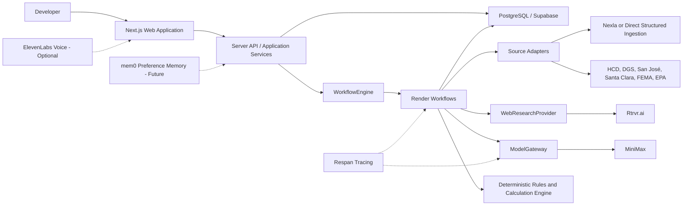

# SiteVelocity

> **Find the sites that can move.**
> **Don't search for land. Search for time.**

SiteVelocity is an AI-native operating system for real-estate development opportunity discovery, pre-development intelligence, and next-step execution.

It helps a professional developer answer:

> Where should we deploy capital next, what can we probably build, what stands in the way, how reliable is the evidence, who can resolve the remaining questions, and what should we do next?

SiteVelocity is not a listing portal, a parcel database, a zoning chatbot, or a replacement for planners, surveyors, engineers, attorneys, title professionals, environmental consultants, lenders, or investment decision-makers. It is an evidence-backed decision-support system that helps those professionals spend time on the sites that matter.

## Project status

The immediate deliverable is a working vertical slice for the July 25, 2026 Prompt Driven Development Hackathon. The repository is designed as the foundation of the full SiteVelocity product rather than as a disposable demo.

The Alpha proves one complete loop:

```text
SEARCH -> DISCOVER -> RESEARCH -> VERIFY -> NEXT STEP
```

Alpha scope:

- Market: San José, California / Santa Clara County
- Strategy: multifamily and mixed-use residential redevelopment
- Initial universe: 50–100 raw government records
- Candidate shortlist: approximately 15 sites
- Deep research: top 5 candidates
- Demo sites: 3 hero sites
- Primary outcome: 1 decision-quality, evidence-backed site dossier

## The problem

Developers do not lack properties. They lack high-confidence opportunities worth spending time and capital on.

A single site can require research across zoning, general plans, entitlements, permits, parcel records, title, tax, easements, environmental databases, flood maps, utilities, infrastructure, prior applications, ownership, and market conditions. The information is distributed across incompatible government systems and documents, and the most important conclusion is often an unresolved question rather than a clean yes or no.

SiteVelocity compresses a large candidate universe into a small set of investigated opportunities while preserving evidence, uncertainty, and professional-verification requirements.

## Product workflow

The production workflow is:

```text
SEARCH -> DISCOVER -> RESEARCH -> VERIFY -> EVALUATE
       -> UNDERWRITE -> MONITOR -> ACT -> LEARN
```

1. A user defines a **Development Buy Box / Acquisition Thesis**.
2. SiteVelocity ingests structured candidate records from government and licensed sources.
3. Scout applies deterministic filters and explainable ranking rules.
4. Specialist agents research land use, development history, public risks, and unresolved issues.
5. A verifier challenges material findings against authoritative sources.
6. Research is persisted as evidence-linked snapshots.
7. The dossier distinguishes what is known, believed, unknown, and professionally unverified.
8. SiteVelocity recommends the highest-value next action and prepares the user to execute it.
9. Production versions learn from pursue, pass, LOI, acquisition, entitlement, and development outcomes.

## Core differentiation

### Development Event Intelligence

The important object is not merely a parcel. It is a meaningful change affecting that parcel:

- rezoning or general-plan change;
- entitlement approval, withdrawal, inactivity, or expiration;
- new permit activity;
- infrastructure funding;
- public-land disposition;
- tax distress or lien activity;
- ownership or portfolio change;
- removal of a condition that previously caused the customer to pass.

### Path-to-Permit Intelligence

SiteVelocity should identify which regulatory and technical steps are complete, required, discretionary, ministerial, expired, or unknown between the current property state and construction.

### Developer-Specific Opportunity Discovery

The long-term platform learns the user's actual acquisition behavior rather than relying only on static filters.

### Next Best Action

The product does not stop at a research report. It identifies:

- the most consequential unresolved question;
- why the answer matters;
- the department or professional role most likely to resolve it;
- known facts to bring to the conversation;
- questions to ask;
- documents to request;
- the expected follow-up.

## Decision framework

SiteVelocity uses five separate decision measures rather than one opaque AI score:

1. **Strategy Fit** — alignment with the customer's development thesis.
2. **Development Readiness** — remaining entitlement and regulatory friction.
3. **Site Feasibility** — preliminary physical and infrastructure feasibility.
4. **Deal Potential** — whether deterministic preliminary economics justify further work.
5. **Evidence Confidence** — authority, freshness, corroboration, conflicts, and missing information.

Material conditions are also displayed as explicit flags and are never diluted inside a composite score.

Examples include missing legal access, prohibited use, flood or wetland conflict, title/easement conflict, unresolved liens, and utility-capacity risk.

All scoring and financial calculations are versioned, deterministic, typed, and reproducible. An LLM may research assumptions or explain outputs; it is never the calculator of record.

## Evidence and uncertainty

Every material finding is linked to evidence and assigned an evidence level:

- **Document Verified**
- **GIS Screened**
- **AI Researched**
- **Professional / Field Verification Required**

Finding status is one of:

- verified;
- probable;
- unknown;
- conflicting.

Impact is classified separately as:

- opportunity;
- cost/timing risk;
- potential fatal constraint;
- unknown.

Important rules:

- “Not found” never becomes “does not exist.”
- A Housing Element site is a candidate, not a verified investment opportunity.
- GIS parcel geometry is not a legal survey boundary.
- A public risk screen is not environmental, title, engineering, or legal clearance.
- Conflicting evidence remains visible.

## Alpha agents

Only six agents are exposed in the hackathon interface:

| Agent | Responsibility |
| --- | --- |
| Scout | Filters and ranks real candidate sites against the thesis |
| Land Use | Researches zoning, general-plan context, and development standards |
| Development History | Reconstructs planning applications, approvals, permits, and inactivity |
| Site Risk | Performs initial public flood, environmental, and obvious-constraint screening |
| Verifier | Challenges high-impact claims and preserves conflicts |
| Next Best Action | Selects the most important unresolved question and how to resolve it |

The production capability map includes parcel integrity, title, ownership, tax/liens, survey, utilities, civil, geotechnical, environmental, access, buildable envelope, development yield, deterministic underwriting, contacts, interaction capture, and investment-committee output. These are routed behind a smaller set of lead capabilities rather than implemented as 39 autonomous LLMs.

## Product modules

The Alpha presents the future application honestly through explicit capability states.

| Module | Alpha state |
| --- | --- |
| Command Center | LIVE |
| Scout Opportunities | LIVE |
| Opportunity Map | LIVE |
| Site Dossier | LIVE |
| Agent Research | LIVE |
| Next Steps | LIVE |
| Watchlists | PREVIEW |
| Development Events | PREVIEW |
| Buildable Envelope | PREVIEW |
| Utilities | PREVIEW |
| Title & Liens | PREVIEW |
| Ownership & Capital | PREVIEW |
| Contacts | PREVIEW |
| Investment Committee | PREVIEW |
| Development Yield | ROADMAP |
| Market Intelligence | ROADMAP |
| Underwriting | ROADMAP |
| Portfolio / CRM | ROADMAP |

`LIVE` means functional now. `PREVIEW` means a truthful future-state explanation is available. `ROADMAP` means intentionally unavailable. Preview interfaces must never display fabricated site-specific results.

## System architecture



The domain depends on internal interfaces, not sponsor SDKs:

- `WorkflowEngine`
- `WebResearchProvider`
- `ModelGateway`
- `ModelRouter`
- `VoiceProvider`
- `PersistenceProvider`
- `GISProvider`
- `SourceAdapter`
- `JurisdictionAdapter`
- `CalculationRegistry`

See [System Design](docs/SYSTEM_DESIGN.md) for implementation details.

## Technology stack

### Application

- Next.js App Router and React
- Strict TypeScript
- Tailwind CSS
- shadcn/ui-compatible component primitives
- Zod at every external and workflow boundary
- MapLibre GL JS for map rendering
- Turf.js for Alpha spatial operations

### Data and persistence

- PostgreSQL, initially hosted by Supabase
- PostGIS when production spatial queries require it; Alpha may use GeoJSON and Turf.js
- Object storage for raw documents and large source payloads
- Versioned SQL migrations
- Immutable evidence and append-oriented Research Snapshots

### Hackathon runtime providers

- **PDD:** prompt/spec artifacts define behavior and regeneration intent
- **Render Workflows:** durable research orchestration, retries, and run status
- **Rtrvr.ai:** targeted public-web retrieval and browser research
- **MiniMax:** structured evidence extraction and synthesis
- **Nexla:** conditional structured dataset ingestion and normalization
- **Respan:** optional low-risk tracing after the core loop works
- **Cerebras:** optional rapid first-pass signal extraction after the core loop works
- **ElevenLabs:** optional verified `Brief Me` text-to-speech feature

### Future/provider options

- mem0 for user preference and pursue/pass memory, never authoritative property facts
- TokenRouter or an internal router for multi-model fallback
- RocketRide as an alternative pipeline implementation, not alongside Render in Alpha
- Tencent EdgeOne as an alternative deployment target
- Featherless for open-model access

## Government data sources

### Candidate generation

- [California HCD Sites Inventory](https://www.hcd.ca.gov/housing-element/sites-inventory)
- [California HCD Housing Open Data Tools](https://www.hcd.ca.gov/planning-and-community-development/housing-open-data-tools)
- [California DGS Housing and Local Land Development Opportunities](https://www.dgs.ca.gov/RESD/Projects/Page-Content/Projects-List-Folder/Housing-and-Local-Land-Development-Opportunities)
- [San José 2023–2031 Housing Element](https://www.sanjoseca.gov/your-government/departments-offices/planning-building-code-enforcement/planning-division/citywide-planning/housing-element/2023-2031-draft-housing-element)

### Parcel, land-use, and development history

- [Santa Clara County Parcels](https://data.sccgov.org/Government/Parcels/ubcd-cewv)
- [San José GIS Open Data Map Service](https://geo.sanjoseca.gov/server/rest/services/OPN/OPN_OpenDataService/MapServer)
- [SJPermits](https://www.sjpermits.org)

### Initial risk screening

- FEMA National Flood Hazard Layer
- EPA ECHO web services
- NRCS Web Soil Survey
- USGS 3DEP
- USFWS IPaC
- FAA Obstruction Evaluation
- National Register / NPS downloads

Every source adapter preserves the raw payload, source URL, agency, source record ID, retrieval timestamp, and normalized output.

## Research Snapshots and demo reliability

Research is persisted as:

```text
Source -> Evidence -> Finding -> Verification -> Decision
```

`DEMO_MODE=true` loads the latest valid stored snapshot immediately. `LIVE_RESEARCH=true` permits selected refreshes. A failed refresh is recorded but never replaces the last valid snapshot.

A snapshot contains:

- source cutoff and creation times;
- evidence and finding identifiers;
- agent/workflow run identifiers;
- complete, partial, or failed status;
- prompt, schema, scoring, and calculation versions where applicable.

Demo mode changes freshness behavior, not factual standards. It never means fake data.

## Prompt Driven Development

Prompts and specifications are durable source artifacts. Generated implementation is replaceable.

Each prompt/spec should define:

- purpose;
- inputs and output schema;
- invariants;
- evidence rules;
- error behavior;
- acceptance criteria;
- test cases.

The intended lifecycle is:

```text
prompt/spec -> generation -> verification/tests
            -> prompt revision -> regeneration
```

Important agent and workflow behavior must not exist only as ad hoc implementation patches.

## Security and trust boundaries

- Keep all provider keys server-side.
- Validate external API, scraped, model, webhook, and workflow payloads with Zod.
- Treat webpages and documents as untrusted data.
- Never follow instructions embedded inside retrieved content.
- Apply URL allow/deny rules and protect against SSRF.
- Use timeouts, bounded retries, backoff, and idempotency keys.
- Redact secrets and unnecessary personal data from logs and traces.
- Verify webhook signatures.
- Retain raw evidence separately from model interpretation.
- Restrict mem0 to preferences and decision memory.
- Keep deterministic calculation results separate from agent output.

## Repository layout

The implementation should converge on:

```text
app/                    Next.js routes, layouts, and server endpoints
components/             UI components and feature views
lib/
  domain/               Domain schemas and invariants
  providers/            Internal provider interfaces
  adapters/             Sponsor and government-source adapters
  calculations/         Deterministic scoring and finance engines
  persistence/          Repositories and database access
  security/             URL policy, sanitization, redaction, signatures
workflows/              Render workflow definitions and orchestration
prompts/
  product/              UI and product-behavior specifications
  agents/               Agent contracts and prompts
  workflows/            Orchestration specifications
  data/                 Ingestion and normalization specifications
  scoring/              Deterministic scoring specifications
generated/              Replaceable PDD-generated artifacts when applicable
docs/                   Architecture, ADRs, runbooks, and source registry
tests/                  Unit, contract, integration, and end-to-end tests
```

## Environment configuration

Expected variables are documented here as names only; never commit their values.

```dotenv
DATABASE_URL=
NEXT_PUBLIC_MAP_STYLE_URL=

DEMO_MODE=true
LIVE_RESEARCH=false

RENDER_API_KEY=
RENDER_WORKFLOW_TASK_SLUG=
RTRVR_API_KEY=
MINIMAX_API_KEY=

NEXLA_API_KEY=
RESPAN_API_KEY=
CEREBRAS_API_KEY=
ELEVENLABS_API_KEY=
MEM0_API_KEY=
```

Only the core provider variables are required for the primary Alpha path. Optional integrations must fail closed and degrade gracefully.

## Definition of Alpha done

- A user can enter a San José multifamily thesis.
- Real government-derived candidates appear.
- Candidates and hero parcel geometry appear on a synchronized map.
- Six visible agents have persisted statuses.
- At least one site has sourced, schema-valid findings.
- The dossier explains why the site surfaced.
- The development-history timeline is evidence-backed.
- Known, believed, unknown, and conflicting information are distinct.
- Material findings expose sources and retrieval timestamps.
- A useful Next Best Action is generated from unresolved findings.
- Render Workflows is used in the real path.
- At least one Rtrvr retrieval and MiniMax structured extraction are real.
- A Research Snapshot loads without rerunning external services.
- A failed refresh preserves the previous valid snapshot.
- PDD artifacts and at least one regeneration cycle are demonstrable.
- The demo can be completed reliably in approximately three minutes.

## Documentation

- [System Design](docs/SYSTEM_DESIGN.md) — technical architecture and implementation blueprint

## License

See [LICENSE](LICENSE).
