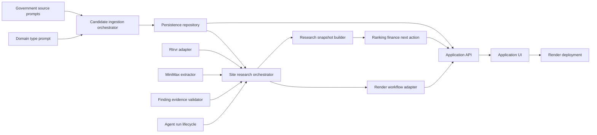

# SiteVelocity PDD Prompt Catalog

This is the generation map for building the complete SiteVelocity Alpha. Every generated module has one prompt contract, one provider-neutral interface, behavioral contract tests, and an accepted evidence manifest before it becomes authoritative.

## Generation order

| Phase | Prompt | Output responsibility |
| --- | --- | --- |
| 1 Foundation | `domain_types_typescript.prompt` | Shared schemas and parse boundaries |
| 2 Source safety | `source-url-policy_typescript.prompt`, `source-record-envelope_typescript.prompt` | Safe source admission and provenance envelopes |
| 3 Government adapters | `arcgis-feature-source-adapter_typescript.prompt`, `socrata-resource-source-adapter_typescript.prompt`, `san-jose-jurisdiction-adapter_typescript.prompt` | Bounded official-record retrieval |
| 4 Candidate pipeline | `candidate_normalizer_typescript.prompt`, `candidate_qualification_typescript.prompt`, `candidate_ingestion_orchestrator_typescript.prompt` | Accounted candidate ingestion |
| 5 Persistence | `persistence_repository_typescript.prompt` | Atomic repositories, snapshots, idempotency receipts |
| 6 Research providers | `rtrvr_research_adapter_typescript.prompt`, `minimax_finding_extractor_typescript.prompt`, `finding_evidence_validator_typescript.prompt` | Retrieval, extraction, and evidence validation |
| 7 Run orchestration | `agent_run_lifecycle_typescript.prompt`, `research_snapshot_builder_typescript.prompt`, `site_research_orchestrator_typescript.prompt` | Six-agent lifecycle and immutable snapshots |
| 8 Decisions | `scout_ranker_typescript.prompt`, `finance_engine_typescript.prompt`, `research_snapshot_selector_typescript.prompt`, `next_best_action_typescript.prompt` | Deterministic prioritization and follow-up |
| 9 Workflow/API | `render_workflow_adapter_typescript.prompt`, `application_api_typescript.prompt` | Durable dispatch and safe application boundary |
| 10 Product UI | `alpha_application_ui_typescript.prompt`, `public-landing-page-ui_typescript.prompt` | Full application and public landing page |
| 11 Deployment | `render-alpha-deployment_typescript.prompt` | Render release, readiness, migration, rollback contract |

## End-to-end dependency graph

## Definition of complete

A phase is complete only when its prompt passes strict contract validation, every rule is mapped to a behavioral test, generated code passes typecheck and lint, affected integration tests pass, and an evidence manifest records the accepted inputs and outputs. Provider credentials and live source payloads never belong in prompts, fixtures, generated output, or evidence manifests.

## Team ownership mapping

- `pdd/foundation`: shared types, persistence boundary, API response conventions.
- `pdd/government-adapters`: URL policy, record envelope, ArcGIS, Socrata, San José adapters.
- `pdd/candidate-pipeline`: normalization, qualification, ingestion orchestration.
- `pdd/research-providers`: Rtrvr, MiniMax, evidence validation, agent lifecycle, research orchestration.
- `pdd/evidence-snapshots`: snapshot builder and active-snapshot selection.
- `pdd/ranking-finance`: Scout ranking, finance, Next Best Action.
- `pdd/app-ui`: application UI and application API integration.
- `pdd/landing-page`: public landing page.
- `pdd/deployment`: Render workflow adapter and deployment contract.
