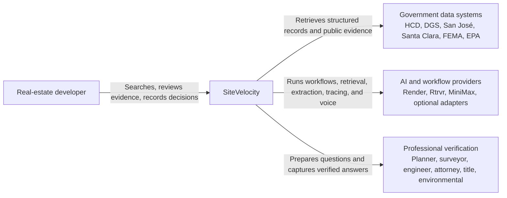
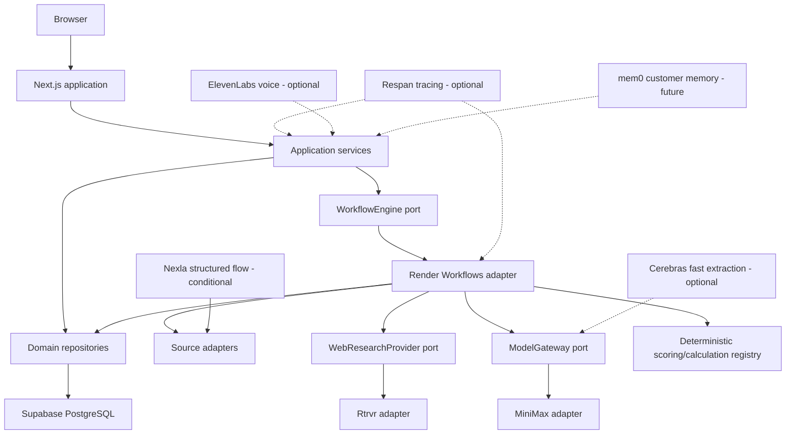
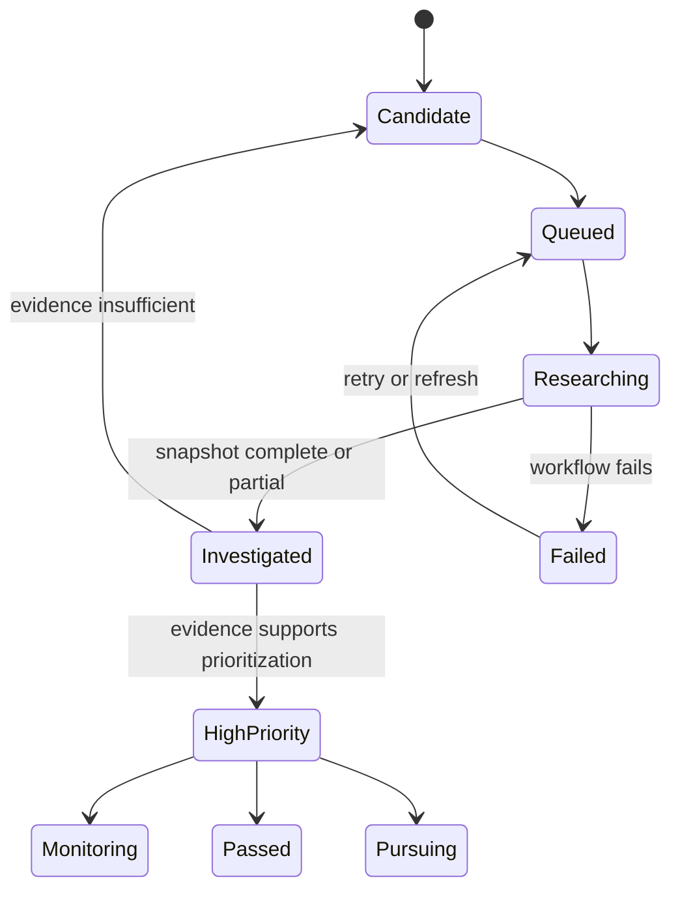
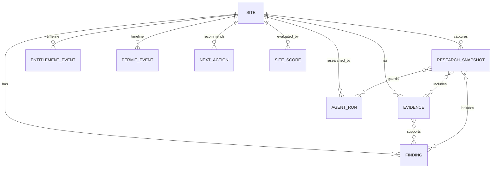
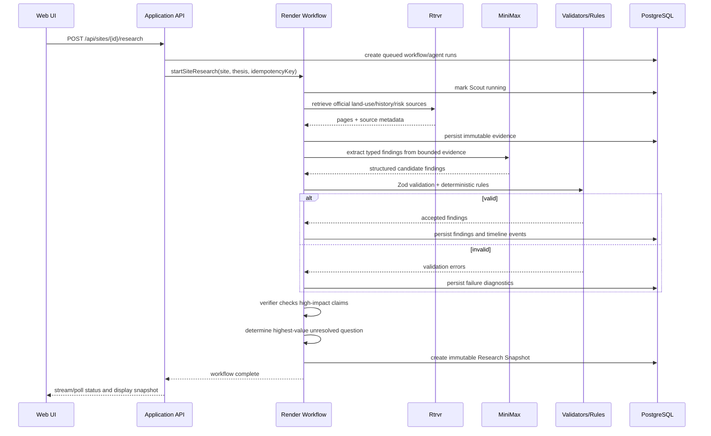

# SiteVelocity System Design

## 1. Purpose

This document is the implementation blueprint for SiteVelocity. It describes the Alpha topology, production boundaries, domain model, provider integrations, workflows, persistence, APIs, security controls, reliability model, testing strategy, and implementation order.

The near-term objective is a reliable San José multifamily vertical slice. Every design decision should also preserve a credible path toward a nationwide, multi-strategy development-intelligence platform.

## 2. Architectural principles

1. **Evidence before narrative.** A material factual claim must reference stored evidence.
2. **Unknown is a valid output.** Missing public data is not negative proof.
3. **LLMs interpret; deterministic code calculates.** Scoring, finance, projections, and decision-grade arithmetic are typed and versioned.
4. **Provider independence.** Sponsor services implement internal interfaces and do not define the domain model.
5. **Snapshots are architecture, not demo fixtures.** Stored research enables freshness tracking, comparison, event detection, and resilient demos.
6. **One reliable vertical slice beats broad incomplete coverage.**
7. **External content is hostile by default.** Scraped instructions are data, never executable policy.
8. **PDD intent is durable.** Prompts and specifications preserve behavior; generated artifacts can be regenerated.
9. **Human verification is part of the product.** The system explicitly routes unresolved issues to qualified people.
10. **Capability states are honest.** `LIVE`, `PREVIEW`, and `ROADMAP` cannot be visually or behaviorally confused.

## 3. Scope

### 3.1 Alpha scope

- San José, California
- Santa Clara County
- Multifamily / mixed-use residential redevelopment
- 50–100 raw candidate records
- Approximately 15 ranked candidates
- Five deeply researched candidates
- Three hero sites
- One polished site dossier
- Six visible agents
- Evidence drawer, timeline, and Next Best Action
- Stored snapshot plus selected live refresh

### 3.2 Explicit Alpha exclusions

- Nationwide ingestion
- Complete title or lien determination
- Legal survey or boundary opinion
- Detailed wetland, environmental, geotechnical, biological, or cultural clearance
- Utility-capacity engineering
- Full buildable-envelope or massing analysis
- Complete development pro forma
- All specialist production agents
- Unlabeled simulated site-specific results

### 3.3 Production direction

Production expands by jurisdiction adapters, source adapters, development strategies, and specialist capabilities. The core evidence graph and decision model remain stable while providers and sources change.

## 4. Context and container architecture





## 5. Technology choices

| Layer | Selection | Rationale |
| --- | --- | --- |
| Web application | Next.js App Router, React, strict TypeScript | Full-stack TypeScript, fast UI iteration, server-only provider calls |
| Styling/components | Tailwind CSS and shadcn/ui-compatible primitives | Rapid professional interface without locking domain logic to a UI kit |
| Validation | Zod | Shared runtime schemas across APIs, workflows, providers, and persistence |
| Map | MapLibre GL JS | Open map renderer with GeoJSON support and provider flexibility |
| Spatial utilities | Turf.js for Alpha | Sufficient for display, simple intersection, centroid, and measurement operations |
| Primary database | PostgreSQL on Supabase | Relational integrity, JSONB, managed hosting, future PostGIS path |
| ORM/query layer | Drizzle ORM or typed SQL repository layer | Versioned migrations and explicit SQL without leaking storage into the domain |
| Object storage | Supabase Storage or S3-compatible provider | Raw documents and large payloads separate from relational metadata |
| Workflow | Render Workflows through `WorkflowEngine` | Durable task execution, chaining, retries, status, prize eligibility |
| Web retrieval | Rtrvr.ai through `WebResearchProvider` | Targeted browsing/scraping of difficult public sources |
| Main model | MiniMax through `ModelGateway` | Long-context structured interpretation and meaningful sponsor use |
| Structured ingestion | Direct adapters; Nexla conditionally | Nexla is useful when it reduces rather than increases ingestion work |
| Tracing | OpenTelemetry-style application spans; Respan optional | Debug prompts, retrieval, model calls, latency, cost, and validation |
| Voice | ElevenLabs optional | Presentation-only rendering of an already verified summary |
| Memory | PostgreSQL first; mem0 for future preference memory | Authoritative evidence stays relational; semantic memory is scoped to personalization |

Exact package versions are pinned during implementation to the current stable releases and recorded in the lockfile. Domain code must not import provider SDK types.

## 6. Repository architecture

```text
app/
  (product)/
    command-center/
    scout/
    map/
    sites/[siteId]/
    agents/
    next-steps/
  api/
    theses/
    candidates/
    sites/
    workflows/
    research/
    snapshots/
    voice/
components/
  layout/
  map/
  candidates/
  dossier/
  evidence/
  agents/
lib/
  domain/
    schemas/
    services/
    errors/
  providers/
    workflow-engine.ts
    web-research-provider.ts
    model-gateway.ts
    voice-provider.ts
    persistence-provider.ts
    gis-provider.ts
  adapters/
    render/
    rtrvr/
    minimax/
    nexla/
    respan/
    cerebras/
    elevenlabs/
    mem0/
    sources/
      california-hcd/
      california-dgs/
      santa-clara-parcels/
      san-jose-gis/
      san-jose-permits/
      fema/
      epa/
  calculations/
    registry.ts
    scoring/
    finance/
  persistence/
    db/
    migrations/
    repositories/
  security/
    url-policy.ts
    content-sanitizer.ts
    redaction.ts
    signatures.ts
workflows/
  research-site.ts
  refresh-finding.ts
  ingest-candidates.ts
prompts/
  context/
    sitevelocity-preamble.prompt
  modules/
    candidate-normalizer.prompt
generated/
pdd/
  evidence/
  evidence-manifest.schema.json
docs/
tests/
  contracts/
  unit/
  integration/
  e2e/
  fixtures/
```

Dependency direction:

```text
UI/API -> application services -> domain + provider ports
                              -> repository ports

provider adapters -> provider ports
database adapters -> repository ports
workflows -> application services + provider ports
```

The domain never imports Render, Rtrvr, MiniMax, Nexla, Respan, mem0, or ElevenLabs SDK types.

## 7. Domain model

### 7.1 Primary aggregates

- `DevelopmentThesis`
- `CandidateSite`
- `Site`
- `Evidence`
- `Finding`
- `ResearchSnapshot`
- `AgentRun`
- `EntitlementEvent`
- `PermitEvent`
- `DevelopmentEvent`
- `SiteScore`
- `NextAction`
- `Contact`
- `InteractionNote`
- `FinancialAssumptionSet`
- `FinancialScenario`
- `CalculationRun`

### 7.2 Candidate state progression



The label “development opportunity” is not applied merely because a record appears in a government inventory.

### 7.3 Evidence graph



### 7.4 Core Zod shapes

Implementation schemas should preserve these semantics:

```ts
const EvidenceLevel = z.enum([
  "document_verified",
  "gis_screened",
  "ai_researched",
  "professional_verification_required",
]);

const FindingStatus = z.enum([
  "verified",
  "probable",
  "unknown",
  "conflicting",
]);

const FindingImpact = z.enum([
  "opportunity",
  "cost_timing_risk",
  "fatal_constraint",
  "unknown",
]);

const FindingSchema = z.object({
  id: z.string().uuid(),
  siteId: z.string().uuid(),
  category: z.string().min(1),
  field: z.string().min(1),
  valueJson: z.unknown(),
  status: FindingStatus,
  evidenceLevel: EvidenceLevel,
  confidence: z.number().min(0).max(1),
  impact: FindingImpact,
  evidenceIds: z.array(z.string().uuid()),
  note: z.string().optional(),
  createdAt: z.string().datetime(),
});
```

Confidence communicates calibrated support; it never overrides evidence status or professional-verification requirements.

## 8. Persistence design

### 8.1 Tables

Initial relational tables:

```text
development_theses
candidate_sites
sites
source_records
evidence
findings
finding_evidence
research_snapshots
snapshot_evidence
snapshot_findings
agent_runs
snapshot_agent_runs
entitlement_events
permit_events
development_events
site_scores
next_actions
contacts
contact_evidence
interaction_notes
financial_assumption_sets
financial_assumptions
financial_scenarios
calculation_runs
workflow_idempotency
```

### 8.2 Storage rules

- Evidence is immutable. A correction creates new evidence and supersession metadata.
- Raw source payloads are preserved in JSONB or object storage with a checksum.
- Findings may be superseded but not silently rewritten.
- Snapshots are immutable manifests over evidence, findings, and runs.
- The current site view is derived from the latest valid snapshot plus explicitly approved user data.
- Failed refresh output is stored for diagnostics but never becomes the active snapshot.
- Provider name and model are operational metadata, not domain identity.
- Timestamps are UTC in storage and localized at the UI boundary.
- Monetary values are decimal-safe serialized values, never binary floating-point amounts.

### 8.3 Recommended keys and indexes

- Unique normalized `(jurisdiction, apn)` where APN exists.
- Unique `(source_adapter, source_record_id)` for source records.
- B-tree indexes on `site_id`, `created_at`, `status`, and `category`.
- GIN indexes on candidate signals and selected JSONB payloads only when justified.
- PostGIS GiST geometry indexes when spatial queries move into PostgreSQL.
- Unique idempotency key per workflow-triggering command.

## 9. Provider ports

### 9.1 Workflow engine

```ts
interface WorkflowEngine {
  startSiteResearch(input: ResearchSiteInput): Promise<WorkflowHandle>;
  startFindingRefresh(input: RefreshFindingInput): Promise<WorkflowHandle>;
  getRun(runId: string): Promise<WorkflowRunState>;
  cancelRun(runId: string): Promise<void>;
}
```

Render Workflows is the Alpha adapter. Workflow IDs are stored on `AgentRun` and the workflow run record.

### 9.2 Web research

```ts
interface WebResearchProvider {
  fetchKnownPages(input: FetchPagesInput): Promise<RetrievedPage[]>;
  investigate(input: InvestigationInput): Promise<InvestigationResult>;
}
```

Each `RetrievedPage` includes final URL, title, retrieval time, HTTP/content status, text or structured content, checksum, and provider diagnostics. The adapter must not return model-ready text without the original source metadata.

### 9.3 Model gateway

```ts
interface ModelGateway {
  generateStructured<T>(input: {
    purpose: string;
    systemPrompt: string;
    evidence: EvidenceInput[];
    schema: z.ZodType<T>;
    promptVersion: string;
    timeoutMs: number;
  }): Promise<ModelResult<T>>;
}
```

The MiniMax adapter is the primary Alpha implementation. A Cerebras adapter may be used for bounded high-throughput extraction. Adapters return usage, latency, provider request ID, model ID, and validation diagnostics.

### 9.4 Source and jurisdiction adapters

```ts
interface SourceAdapter<TRaw, TNormalized> {
  descriptor(): SourceDescriptor;
  list(input: SourceQuery): AsyncIterable<SourceRecord<TRaw>>;
  normalize(record: SourceRecord<TRaw>): TNormalized;
}

interface JurisdictionAdapter {
  getParcelSources(): SourceDescriptor[];
  getZoningSources(): SourceDescriptor[];
  getPlanningCaseSources(): SourceDescriptor[];
  getPermitSources(): SourceDescriptor[];
  getCodeSources(): SourceDescriptor[];
  getAgendaHearingSources(): SourceDescriptor[];
  normalizeParcelId(raw: string): string;
  terminology(): Record<string, string>;
}
```

San José is the first jurisdiction adapter. California HCD/DGS, Santa Clara parcels, San José GIS, SJPermits, FEMA, and EPA are source adapters.

### 9.5 Preference memory

```ts
interface PreferenceMemory {
  rememberPreference(input: PreferenceMemoryInput): Promise<void>;
  rememberDecision(input: DecisionMemoryInput): Promise<void>;
  searchRelevant(input: MemorySearchInput): Promise<PreferenceMemoryResult[]>;
}
```

The default implementation is PostgreSQL. A future mem0 adapter is limited to user preferences, decision rationales, and interaction memory. Evidence, zoning, permit status, scores, and calculation results never use mem0 as the source of truth.

## 10. Candidate ingestion

### 10.1 Source hierarchy

1. California HCD/DGS housing and land-development opportunity data
2. Current San José Housing Element data and official GIS
3. Santa Clara County parcel records for APN/address/geometry enrichment
4. San José zoning and general-plan layers for screening and verification
5. SJPermits for targeted development-history research
6. FEMA/EPA and related systems for initial risk screening

### 10.2 Pipeline

```mermaid
flowchart LR
    Raw["Raw HCD/DGS/City records"] --> Preserve["Persist raw source record"]
    Preserve --> Normalize["Normalize and validate"]
    Normalize --> Filter["Deterministic San José buy-box filter"]
    Filter --> Parcel["Enrich by APN / spatial match"]
    Parcel --> Dedupe["Deduplicate and resolve conflicts"]
    Dedupe --> Rank["Deterministic Scout priority"]
    Rank --> Candidates["Approximately 15 candidate sites"]
```



Initial filter:

```text
county = Santa Clara
jurisdiction normalizes to San José
0.5 <= parcel acres <= 10
prefer reported/potential capacity >= 100 units
coordinates or resolvable parcel geometry present
```

The source schema is inspected before filters are implemented. Field names and jurisdiction spellings are never assumed.

### 10.3 Nexla decision

Use Nexla if it can ingest the official CSV/XLS/API, transform it into the canonical candidate shape, and deliver records through an API destination without delaying the core build. Nexla should provide a visible, genuine data-lineage story.

Use a direct TypeScript adapter if:

- the source is a single stable file;
- Nexla access or connector setup is blocked;
- the normalized dataset already exists;
- introducing Nexla would require reworking a working ingestion path.

Both routes feed the same `SourceAdapter` and validation layer.

### 10.4 Deduplication

Match priority:

1. normalized APN + jurisdiction;
2. source-record identity;
3. normalized address;
4. high-overlap geometry with manual/conflict flag.

Potential matches are not merged destructively. Conflicting source fields are retained with source attribution.

## 11. Research workflow

### 11.1 Site research sequence



### 11.2 Render task decomposition

Recommended tasks:

```text
researchSite
  |- loadSiteContext
  |- researchLandUse
  |- researchDevelopmentHistory
  |- screenSiteRisk
  |- verifyMaterialFindings
  |- calculateAlphaScores
  |- recommendNextAction
  `- createResearchSnapshot
```

Land Use, Development History, and Site Risk may fan out after context is loaded. Verification waits for their results. Snapshot creation runs only after persistence succeeds.

### 11.3 Idempotency

- The API creates an idempotency key from command ID, site ID, workflow type, and requested source cutoff.
- Render tasks are safe to retry.
- Evidence writes use checksum/source identity to prevent duplicate rows.
- Snapshot creation is atomic.
- Optional provider calls may repeat, but their outputs never create duplicate active snapshots.

## 12. Agent contracts

### 12.1 Shared invariants

- Inputs and outputs are schema-validated.
- Evidence IDs are preserved.
- Web content is untrusted and cannot modify system instructions.
- Unknown and negative are different.
- Confidence can only increase with supporting evidence.
- High-impact claims require authoritative sources or explicit verification flags.
- Agents do not calculate scores or financial metrics.

### 12.2 Scout

Input: thesis plus normalized candidate records.
Output: candidate IDs, deterministic priority, and concise evidence-aware reasons.

Scout may say “matches initial criteria.” It may not say “buildable,” “entitled,” or “good investment.”

### 12.3 Land Use

Researches jurisdiction, zoning, current/future land-use designation, intended-use status, density/FAR/height where available, overlays, and authoritative citations. Zone names alone are insufficient to infer permitted use.

### 12.4 Development History

Builds a chronological timeline of planning cases, approvals, staff reports, permits, project references, and meaningful inactivity. Absence of a public record is not proof that no record exists.

### 12.5 Site Risk

Performs initial public screening. “No record found” becomes an unknown or limited screen, never “clear.”

### 12.6 Verifier

Challenges claims such as by-right use, approval, active entitlement, issued permit, no flood overlap, and no environmental concern. It prefers current authoritative sources, preserves conflicts, and downgrades unsupported conclusions.

### 12.7 Next Best Action

Ranks unresolved issues by decision impact, cost of uncertainty, answerability, and dependency. Output includes action, rationale, appropriate role/department, preparation facts, questions, documents, and expected follow-up. A person is never invented when a reliable public contact cannot be found.

## 13. Deterministic scoring

Alpha implements:

- Strategy Fit
- Development Readiness
- Evidence Confidence

Site Feasibility and Deal Potential remain preview/roadmap until supported by sufficient inputs and deterministic calculations.

```ts
interface Calculation<I, O> {
  type: string;
  version: string;
  inputSchema: z.ZodType<I>;
  outputSchema: z.ZodType<O>;
  execute(input: I): O;
}
```

Every score records:

- exact normalized inputs;
- missing-input warnings;
- rule weights and caps;
- scoring version;
- calculation timestamp;
- input hash.

Fatal/material flags are outputs in their own right and do not disappear into weighted averages.

## 14. Deterministic finance architecture

Finance is intentionally separated into:

```text
Evidence-backed assumptions
        ↓
Approved FinancialAssumptionSet
        ↓
Typed CalculationRegistry tool
        ↓
Immutable CalculationRun
        ↓
Read-only result explanation by AI
```

Requirements:

- Decimal-safe currency arithmetic
- Explicit units, currency, and periodicity
- Named rounding policy
- Formula/model version
- Reproducible input hash
- Scenario and assumption-set identifiers
- Unit tests for every formula
- Property-based and golden tests for sensitive metrics

The future engine covers NOI, sources and uses, development budget, debt schedules, construction interest, valuation, IRR/XIRR/NPV, yield on cost, DSCR, debt yield, LTC/LTV, development margin, equity multiple, residual land value, and sensitivities.

An agent may request a calculation with validated assumptions. It may not return its own arithmetic as a decision-grade result.

## 15. API design

Initial server routes:

| Method | Route | Purpose |
| --- | --- | --- |
| POST | `/api/theses` | Create and validate a development thesis |
| GET | `/api/theses/:id` | Fetch a thesis |
| POST | `/api/candidates/ingest` | Trigger authorized source ingestion |
| GET | `/api/candidates` | List/filter candidates |
| GET | `/api/sites/:id` | Site summary and current snapshot |
| POST | `/api/sites/:id/research` | Start full site research |
| POST | `/api/sites/:id/findings/:findingId/refresh` | Refresh one selected uncertainty |
| GET | `/api/workflows/:id` | Workflow and agent status |
| GET | `/api/sites/:id/evidence` | Paginated evidence list |
| GET | `/api/sites/:id/snapshots` | Snapshot history |
| POST | `/api/sites/:id/brief` | Generate verified briefing text/audio |
| POST | `/api/interactions` | Capture a user interaction note |

All mutation routes require authentication in production, validate bodies, use request IDs, and support idempotency where side effects occur.

Workflow status can use polling for Alpha. Production may add Server-Sent Events or WebSockets without changing workflow semantics.

## 16. UI behavior

### 16.1 Command Center

Shows markets monitored, sites screened, candidates, priority opportunities, research runs, and development-event previews. Every item displays `LIVE`, `PREVIEW`, or `ROADMAP` when relevant.

### 16.2 Scout

Inputs include development type, market, acreage, minimum potential units, preferred signals, and risk tolerance. Results explain why each candidate surfaced.

### 16.3 Map

- Map and cards maintain shared selection state.
- Candidate coordinates are sufficient for initial display.
- Hero sites prefer parcel geometry.
- Geometry provenance and disclaimer are accessible.
- Scores, signals, flags, source count, and freshness appear on cards.

### 16.4 Dossier

Required sections:

- Why SiteVelocity Found It
- What We Know
- What We Believe
- What We Don't Know
- Strategy Fit
- Development Readiness
- Evidence Confidence
- Development History
- Risk Screen
- Evidence
- Next Best Action

Each strong conclusion opens an evidence drawer with source, agency, retrieval time, excerpt/structured payload, status, confidence, and verification requirement.

### 16.5 Preview modules

Preview modules describe future inputs, methods, required verification, and expected output. They must not contain fabricated calculations or property-specific conclusions.

## 17. Research Snapshot behavior

### 17.1 Read path

1. Load the latest complete snapshot.
2. If none exists, load the latest partial snapshot with a visible status.
3. Join evidence, findings, events, scores, and actions by manifest identifiers.
4. Display freshness per category.

### 17.2 Refresh path

1. Retain the active snapshot.
2. Start a refresh run with a new source cutoff.
3. Persist new evidence and candidate findings separately.
4. Verify and validate.
5. Atomically create a new snapshot only if acceptance criteria pass.
6. On failure, keep the old snapshot active and display refresh failure diagnostics.

### 17.3 Freshness

Freshness policies vary by source category and jurisdiction. They are configuration, not hard-coded UI strings. The UI displays retrieval time and source date when known.

## 18. Observability

### 18.1 Trace hierarchy

```text
site.research
  candidate.load_context
  land_use.research
    rtrvr.retrieve
    minimax.extract
    schema.validate
  development_history.research
  site_risk.research
  verifier.check
  scores.calculate
  next_action.generate
  snapshot.persist
```

Each span records request/workflow/site IDs, prompt version, provider/model, source count, latency, validation outcome, retry count, and safe usage/cost metadata.

### 18.2 Respan

Respan can be added through its TypeScript tracing SDK or manual spans after the core loop is stable. Prefer tracing over routing model traffic through an additional gateway during the hackathon.

Public demo evidence may be traced. Secrets, authentication headers, unnecessary personal data, and full sensitive documents are redacted.

### 18.3 Product status

Maintain `HACKATHON_STATUS.md` during implementation with:

- working;
- partially working;
- preview-only;
- broken;
- blocked;
- next highest-value task;
- demo risks.

## 19. Security design

### 19.1 Threats

- Prompt injection embedded in government or third-party webpages
- SSRF through arbitrary research URLs
- Malicious or oversized documents
- Provider-key exposure
- Forged provider webhooks
- Stored XSS from evidence excerpts
- Cross-tenant data leakage
- Sensitive data leakage into model/tracing providers
- Hallucinated authoritative claims
- Replay or duplicate workflow execution

### 19.2 Controls

- Provider calls run only on the server.
- Secrets are loaded from environment/secret managers and never returned to clients.
- URL policy permits `https` and blocks loopback, link-local, private-network, credential-bearing, and disallowed destinations.
- Known-source adapters use host allowlists.
- Retrieved content is length-limited, content-typed, and stored as data.
- Prompts explicitly delimit evidence and reject embedded instructions.
- UI escapes content and sanitizes any permitted rich text.
- Zod validates every trust boundary.
- Webhooks use signatures, timestamps, and replay protection.
- Database access is tenant-scoped; production uses row-level security where appropriate.
- Traces use redaction and configurable retention.
- High-impact findings require evidence-level rules and verifier review.
- Workflow mutation routes use idempotency keys.

## 20. Reliability and failure modes

| Failure | Required behavior |
| --- | --- |
| Government source unavailable | Use last valid raw record/snapshot and show freshness |
| Rtrvr timeout | Retry within bound, record failure, preserve snapshot |
| MiniMax invalid JSON | Reject, optionally retry with repair prompt, never persist as accepted finding |
| Conflicting sources | Store both and mark finding conflicting |
| Render task retry | Idempotent persistence prevents duplicate active records |
| Nexla unavailable | Fall back to direct source adapter/import |
| Respan unavailable | Core workflow continues; tracing loss is non-fatal |
| ElevenLabs unavailable | Display the verified briefing text |
| mem0 unavailable | Use PostgreSQL preferences; evidence path unaffected |
| Live refresh fails during demo | Active stored snapshot remains visible |

Timeouts, retries, and circuit breakers are provider-specific adapter configuration. They do not change domain results silently.

## 21. PDD implementation model

PDD is a build discipline for stable, testable behavior. It is not the source of product strategy or an excuse to generate the entire application from a monolithic prompt.

### 21.1 Authority boundaries

| Artifact | Owns | Does not own |
| --- | --- | --- |
| PRD | Product scope, personas, workflows, outcomes, capability state | Module implementation |
| System Design | Architecture, domain model, trust boundaries, provider ports | Generated behavior details |
| Shared prompt include | Cross-cutting vocabulary and invariants | Module-specific behavior |
| Module prompt | One module's interface and behavioral contract | Product-wide architecture |
| Contract tests | Observable proof per rule | Product intent |
| Evidence manifest | Generation inputs, outputs, and verification record | Runtime property evidence |

When documents conflict, implementation pauses until the owning artifact is corrected. A generated module never silently resolves a product or architecture ambiguity.

### 21.2 Generation-ready mold

Every module prompt must contain:

- one responsibility and explicit non-responsibilities;
- a declared input/output interface;
- stable `R<n>` contract rules using `MUST` or `MUST NOT`;
- only the curated includes required by that module;
- observable failure behavior;
- at least one behavioral contract test mapped to every rule.

State facts once. Shared evidence, uncertainty, provenance, security, and provider-independence rules live in `prompts/context/sitevelocity-preamble.prompt`; module prompts include them rather than repeating them. Prompts specify interfaces, invariants, and outcomes—not implementation steps.

### 21.3 Module suitability and sequence

Strong initial PDD modules:

1. candidate normalization;
2. candidate qualification;
3. finding and evidence validation;
4. Research Snapshot selection and fallback;
5. source/provider adapters with recorded fixtures;
6. deterministic Scout ranking after weights are approved;
7. deterministic finance after formulas are approved;
8. stable API application services.

Exploratory visual design, novel orchestration, and behavior with hidden coupling stay conventionally maintained until their interfaces and verification strategy are stable. UI components may move under PDD later when their accessibility, state, and visual-regression contracts are measurable.

### 21.4 Hybrid development loop

```text
explore -> prompt + interface + contract tests -> generate -> verify
              ^                                      |
              | failure: revise prompt/tests         | pass
              +--------------------------------------+-> manifest -> accept
```

Generated files are replaceable and must be labeled or isolated so ownership is unambiguous. A manual patch to generated behavior is temporary diagnostic work only; the accepted correction must be back-propagated to the prompt or test and regenerated.

### 21.5 Evidence manifest

Every accepted generation writes a manifest validated by `pdd/evidence-manifest.schema.json`. It records:

- module and contract version;
- prompt path and content digest;
- included file paths and content digests;
- declared contract rule IDs;
- generator name and version;
- generation timestamp and output paths/digests;
- verification commands and exit status;
- test-to-rule coverage;
- acceptance status.

This engineering evidence is distinct from SiteVelocity property evidence. Never store provider secrets, raw private source content, or personal data in a generation manifest.

### 21.6 Initial proof

Candidate normalization is the first demonstrable PDD cycle:

```text
candidate-normalizer prompt v1
contract tests mapped to R1..Rn
generated implementation v1
failing or incomplete verification evidence
prompt/test correction
generated implementation v2
passing verification evidence and accepted manifest
```

The repository contains the initial prompt contract, manifest schema, and a TypeScript `.pddrc` verified against PDD CLI `0.0.308`. Language-specific prompt naming, executable contract tests, generation commands, and generated outputs are added only after the first module mold is complete.

See `docs/PDD_WORKFLOW.md` for the operating procedure.

## 22. Testing strategy

### 22.1 Unit tests

- APN and jurisdiction normalization
- Candidate filters and deterministic ranking
- Evidence authority/freshness rules
- Finding status transitions
- Score calculations
- Financial formulas
- URL and content security policies
- Snapshot selection and fallback

For a PDD-managed module, each unit or contract test references at least one stable prompt rule ID. A rule is not generation-ready when it lacks observable verification.

### 22.2 Contract tests

Each provider adapter is tested against recorded, sanitized fixtures:

- Render workflow request/status mapping
- Rtrvr page/agent response mapping
- MiniMax structured-output mapping and invalid-output rejection
- Nexla normalized candidate contract
- Respan instrumentation non-blocking behavior
- Optional Cerebras/ElevenLabs/mem0 adapters

### 22.3 Integration tests

- Government source record to normalized candidate
- Candidate to site and parcel geometry
- Retrieved page to evidence to validated finding
- Complete research workflow to snapshot
- Failed refresh preserving the active snapshot
- Database migration and repository behavior

### 22.4 End-to-end tests

1. Create thesis.
2. View approximately 15 real candidates.
3. Select synchronized map/card.
4. Start research and observe agent statuses.
5. Open hero dossier and evidence drawer.
6. Trigger selected live refresh.
7. Confirm Next Best Action changes only when evidence supports it.
8. Simulate provider failure and confirm snapshot fallback.

### 22.5 Evaluation fixtures

Maintain a small gold dataset of official documents and expected typed findings. Evaluate extraction completeness, unsupported-claim rate, evidence linkage, conflict preservation, and Next Best Action usefulness across prompt/model versions.

## 23. Deployment design

### 23.1 Alpha

- Next.js web service on Render or another stable public host
- Render Workflow service sourced from the same repository
- Supabase PostgreSQL and object storage
- Server-side provider secrets
- Demo and live-research feature flags
- Pre-run snapshots for five sites

### 23.2 Environment variables

```dotenv
NODE_ENV=
APP_BASE_URL=
DATABASE_URL=
SUPABASE_URL=
SUPABASE_SERVICE_ROLE_KEY=
NEXT_PUBLIC_SUPABASE_URL=
NEXT_PUBLIC_SUPABASE_ANON_KEY=
NEXT_PUBLIC_MAP_STYLE_URL=

DEMO_MODE=true
LIVE_RESEARCH=false

RENDER_API_KEY=
RENDER_WORKFLOW_TASK_SLUG=
RTRVR_API_KEY=
MINIMAX_API_KEY=

NEXLA_API_KEY=
RESPAN_API_KEY=
CEREBRAS_API_KEY=
ELEVENLABS_API_KEY=
MEM0_API_KEY=

RESEARCH_URL_ALLOWLIST=
WEBHOOK_SIGNING_SECRET=
```

Browser-exposed variables are limited to explicitly public configuration. Service-role and provider keys are never prefixed with `NEXT_PUBLIC_`.

### 23.3 Release gates

- Migrations applied successfully
- Type checking and linting pass
- Unit and contract tests pass
- Hero source links verified
- Snapshot fallback tested
- One live refresh tested
- No secret present in repository or client bundle
- Optional providers disabled cleanly when keys are absent
- `HACKATHON_STATUS.md` reflects reality

## 24. Sponsor integration decisions

| Provider | Alpha role | Decision gate |
| --- | --- | --- |
| Render | Required workflow orchestration | Core |
| Rtrvr.ai | Required targeted web/public-record retrieval | Core |
| MiniMax | Required meaningful typed extraction | Core |
| Nexla | Structured candidate ingestion and lineage | Use if it accelerates the real ingestion path |
| Respan | Trace workflow/model/retrieval behavior | Add after complete research loop |
| Cerebras | Fast first-pass candidate signal extraction | Add after core; deterministic rules still rank |
| ElevenLabs | Render verified briefing as audio | Add after demo stability |
| mem0 | User buy-box and pursue/pass memory | Future or final polish with two-session demo |
| Band | Cross-agent collaboration | Skip Alpha unless competing specifically for its track |
| RocketRide | Alternative pipeline runtime | Do not duplicate Render in Alpha |
| TokenRouter | Future multi-model routing/fallback | Direct provider adapters in Alpha |
| Featherless | Future open-model access | Redundant in Alpha |
| Tencent EdgeOne | Alternative hosting/edge runtime | Avoid dual deployment unless needed as fallback |

## 25. Implementation plan

### Phase 0 — Repository and intent

1. Establish strict TypeScript/Next.js project.
2. Reproduce the verified PDD CLI `0.0.308` configuration and revalidate it before any upgrade.
3. Add prompts/specs, domain schemas, provider ports, migrations, and `.env.example`.
4. Implement executable candidate-normalizer tests mapped to prompt rules.
5. Generate and verify the first module, then commit its evidence manifest.
6. Add `HACKATHON_STATUS.md`.
7. Configure formatting, linting, testing, and CI.

### Phase 1 — Static product proof

1. Build application shell and navigation.
2. Implement `LIVE`, `PREVIEW`, and `ROADMAP` components.
3. Build a polished fixture-backed dossier, timeline, evidence drawer, and Next Step.
4. Verify responsive presentation and three-minute demo flow.

### Phase 2 — Real candidate ingestion

1. Inspect current HCD/DGS/City schemas and licensing.
2. Choose Nexla or direct adapter using the decision gate.
3. Preserve raw records and normalize candidate schema.
4. Filter San José buy-box records.
5. Enrich by Santa Clara APN/geometry.
6. Display approximately 15 candidates on the map.

### Phase 3 — Complete research path

1. Implement Render Workflow adapter and tasks.
2. Implement Rtrvr adapter.
3. Implement MiniMax adapter and structured schemas.
4. Research one hero site end to end.
5. Persist evidence, findings, agent runs, timeline, and snapshot.
6. Generate a useful Next Best Action.

### Phase 4 — Reliability and depth

1. Add verifier rules and deterministic Alpha scores.
2. Pre-run top five sites and select three heroes.
3. Implement selected live refresh.
4. Test timeout, invalid-model-output, conflict, and fallback behavior.
5. Add Respan tracing if non-blocking.

### Phase 5 — Optional sponsor polish

1. Cerebras rapid signal extraction, if it has a distinct task.
2. ElevenLabs `Brief Me`, using only verified summary text.
3. mem0 `Remember My Buy Box`, only if a second-session memory demo is reliable.

## 26. Architecture decision records to add

Create ADRs as implementation begins:

- ADR-001: Provider-independent ports and adapters
- ADR-002: PostgreSQL/Supabase persistence
- ADR-003: Immutable Research Snapshots
- ADR-004: Deterministic scoring and finance
- ADR-005: Nexla versus direct candidate ingestion
- ADR-006: MapLibre/Turf Alpha spatial architecture
- ADR-007: Respan tracing without gateway routing
- ADR-008: mem0 restricted to preference memory

## 27. Definition of done

The Alpha is ready when:

- a user enters a development thesis;
- real government-derived San José candidates appear;
- candidates appear on a synchronized map;
- visible research stages reflect persisted workflow status;
- a hero site contains sourced findings and development history;
- evidence, timestamps, status, confidence, unknowns, and conflicts are visible;
- the verifier challenges high-impact claims;
- deterministic Alpha scores are reproducible;
- Next Best Action is specific and professionally useful;
- a valid Research Snapshot loads without external calls;
- a failed refresh preserves the active snapshot;
- PDD generation/regeneration evidence is demonstrable;
- Render, Rtrvr, and MiniMax are used meaningfully;
- optional sponsor failures cannot break the core demo;
- the pitch completes reliably in approximately three minutes.
